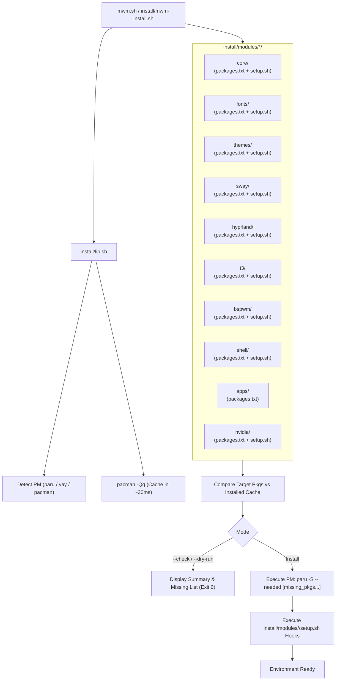

# MWM Modular Installer & Package Architecture

> **Target Audience:** Autonomous AI Agents & Developers  
> **Package Location:** [`~/.config/my-wm/scripts/install/`](file:///home/user/.config/my-wm/scripts/install/) (Wrapper: [`~/mwm.sh`](file:///home/user/mwm.sh))  
> **Status:** Active & Production-Ready

---

## 1. Overview & Architectural Goals

The MWM Installer provides an automated, decoupled, and modular package management and setup engine for Arch Linux.

### Key Architectural Principles
1. **Directory-per-Module Isolation:** Every desktop component or window manager resides in its own folder under `install/modules/<name>/`, maintaining its own package list (`packages.txt`) and optional setup hook (`setup.sh`).
2. **Zero-Friction Reinstallation:** Single command setup for any supported window manager (Sway, Hyprland, i3, BSPWM).
3. **Fast In-Memory Diffing:** Queries the local package database via `pacman -Qq` in ~30ms to build an in-memory map. Only packages identified as *missing* are passed to the package manager (`paru` / `yay` / `pacman`).
4. **Dynamic Discovery:** Modules added to `install/modules/` are automatically discovered by `lib.sh` and exposed in the CLI without hardcoded script registries.
5. **Decoupled Setup Hooks:** Setup routines (such as font cache refreshing, theme asset compilation via `apply.sh`, or systemd service enablement) run sequentially per module after package installation.



---

## 2. Directory Structure

```
~/.config/my-wm/scripts/install/
├── mwm-install.sh                  # Main CLI entrypoint & orchestrator
├── lib.sh                          # Shared library (cache, package diffing, PM detection, hook runner)
└── modules/                        # Component-specific modules directory
    ├── core/
    │   ├── packages.txt            # Base desktop utilities
    │   └── setup.sh                # User keyring & polkit
    ├── fonts/
    │   ├── packages.txt            # Typography & nerd fonts
    │   └── setup.sh                # fc-cache -fv
    ├── themes/
    │   ├── packages.txt            # GTK/Qt themes & engines
    │   └── setup.sh                # apply.sh fonts --no-reload
    ├── sway/
    │   ├── packages.txt            # Sway compositor suite
    │   └── setup.sh
    ├── hyprland/
    │   ├── packages.txt            # Hyprland compositor suite
    │   └── setup.sh
    ├── i3/
    │   ├── packages.txt            # i3 X11 suite
    │   └── setup.sh
    ├── bspwm/
    │   ├── packages.txt            # BSPWM X11 suite
    │   └── setup.sh
    ├── shell/
    │   ├── packages.txt            # zsh, lsd, bat, etc.
    │   └── setup.sh                # powerlevel10k, zsh-sudo
    ├── apps/
    │   └── packages.txt            # User applications
    └── nvidia/
        ├── packages.txt            # Drivers & utils
        └── setup.sh                # Suspend/resume services
```

---

## 3. CLI Interface & Contract

### Supported Profiles

| Flag | Included Modules | Description |
|---|---|---|
| `--sway` | `core`, `fonts`, `themes`, `sway`, `shell` | Complete Sway Wayland desktop |
| `--hyprland` / `--hypr` | `core`, `fonts`, `themes`, `hyprland`, `shell` | Complete Hyprland Wayland desktop |
| `--i3` | `core`, `fonts`, `themes`, `i3`, `shell` | Complete i3 X11 desktop |
| `--bspwm` | `core`, `fonts`, `themes`, `bspwm`, `shell` | Complete BSPWM X11 desktop |
| `--all` | All modules in `modules/` | All window managers and applications |

### Granular Module Selection (`-m`, `--module`)

Modules can be selected individually:
```bash
./mwm.sh -m core -m fonts -m sway
./mwm.sh -m shell -m apps
```

### Execution Modifiers

| Flag | Purpose |
|---|---|
| `-c`, `--check`, `--dry-run` | Prints validation summary table and lists missing packages without installing. |
| `--setup-only`, `--post-install` | Executes only the `setup.sh` hooks of the selected modules without installing packages. |
| `--skip-setup` | Skips `setup.sh` hooks after package installation. |
| `--no-confirm` | Passes `--noconfirm` to the underlying package manager for automated installs. |
| `-h`, `--help` | Prints CLI usage guidelines. |

---

## 4. How to Create a New Module

1. Create a directory `~/.config/my-wm/scripts/install/modules/<name>/`.
2. Add `packages.txt` listing the packages line-by-line (lines starting with `#` are ignored).
3. (Optional) Add `setup.sh` with post-installation commands (e.g., config generation, services).
4. Run `./mwm.sh -m <name> --check` to verify.
