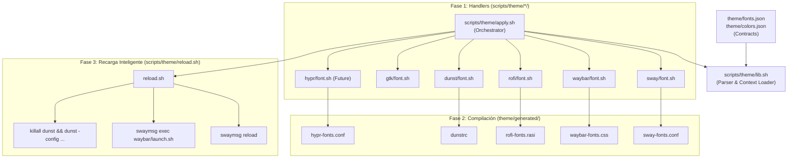

# Theme & Font Parametrization Architecture

> **Target Audience:** Autonomous AI Agents  
> **Package Location:** [`~/.config/my-wm`](file:///home/user/.config/my-wm)  
> **Status:** Active & Production-Ready

---

## 1. Overview & Architectural Goals

The `my-wm` theme engine provides a centralized, contract-driven, multi-WM configuration system for fonts and colors. It follows a **Plugin / Handler Architecture** where high-level design tokens (fonts, colors, severity rules) are defined in JSON contracts and compiled into native syntax files for each desktop component (Sway, Waybar, Dunst, Rofi, GTK, Hyprland).



---

## 2. Directory Structure Conventions

```
~/.config/my-wm/
├── theme/
│   ├── fonts.json                             <-- Input Contract (Fonts)
│   ├── colors.json                            <-- Input Contract (Colors & Severity, Future/Optional)
│   └── generated/                             <-- Compiled Output (Standard suffix: -fonts, -colors)
│       ├── sway-fonts.conf
│       ├── waybar-fonts.css
│       ├── rofi-fonts.rasi
│       ├── dunstrc                            <-- Dunst config compiled without mutating git repo
│       └── hypr-fonts.conf                   <-- Hyprland snippet
└── scripts/
    └── theme/
        ├── apply.sh                           <-- Entrypoint CLI Orchestrator
        ├── lib.sh                             <-- Shared JSON parser & environment loader
        ├── reload.sh                          <-- Smart multi-WM process reloader
        ├── sway/
        │   └── font.sh                        <-- Sway font handler
        ├── waybar/
        │   └── font.sh                        <-- Waybar font handler
        ├── rofi/
        │   └── font.sh                        <-- Rofi font handler
        ├── dunst/
        │   └── font.sh                        <-- Dunst font handler
        ├── gtk/
        │   └── font.sh                        <-- GTK gsettings handler
        └── hypr/
            └── font.sh                        <-- Hyprland font handler
```

---

## 3. Input Contracts Specification

### A. Font Contract: `~/.config/my-wm/theme/fonts.json`

```json
{
  "$schema": "http://json-schema.org/draft-07/schema#",
  "type": "object",
  "required": ["font_family_primary", "font_family_fallback", "font_size_pt", "font_size_px"],
  "properties": {
    "font_family_primary": {
      "type": "string",
      "description": "Primary monospace / UI font name (e.g., 'RobotoMono Nerd Font')"
    },
    "font_family_fallback": {
      "type": "string",
      "description": "Comma-separated fallback fonts in order of priority (e.g., 'FiraCode Nerd Font, JetBrains Mono, Cantarell, sans-serif')"
    },
    "font_size_pt": {
      "type": "integer",
      "description": "Base font size in points for Pango/Dunst/Rofi/GTK (e.g., 10)"
    },
    "font_size_px": {
      "type": "integer",
      "description": "Base font size in pixels for CSS/Waybar (e.g., 13)"
    }
  }
}
```

### B. Color Contract: `~/.config/my-wm/theme/colors.json` (Specification for Future Tasks)

```json
{
  "theme_name": "custom-dark",
  "palette": {
    "background": "#1a110f",
    "surface": "#201927",
    "on_surface": "#f1dfda",
    "primary": "#59496c",
    "on_primary": "#f9f7fa",
    "secondary": "#7f689a",
    "on_secondary": "#ffffff",
    "border": "#3a3a3a",
    "border_focused": "#7f689a",
    "severity": {
      "info": "#2e9ef4",
      "on_info": "#ffffff",
      "success": "#61c766",
      "on_success": "#ffffff",
      "warning": "#f38ba8",
      "on_warning": "#1a110f",
      "critical": "#ff5555",
      "on_critical": "#ffffff"
    }
  }
}
```

---

## 4. Handler Specifications & Rules

Every handler script must strictly adhere to the following contract:

1. **Location:** `~/.config/my-wm/scripts/theme/<component>/<feature>.sh` (e.g., `waybar/font.sh`, `sway/colors.sh`).
2. **Context Loading:** Must source `../lib.sh` and call `load_fonts_context` or `load_colors_context`.
3. **Purity & Single Responsibility:** Handlers must **only** compile and write their respective output file to `$GEN_DIR/<component>-<feature>.<ext>`.
4. **No Process Reloads inside Handlers:** Handlers **must NOT** execute `swaymsg reload`, `killall waybar`, or send signals directly. Reloading is strictly the responsibility of `reload.sh`.
5. **Output File Naming:** Must use the standardized suffix:
   - `<component>-fonts.<ext>` for font compilation.
   - `<component>-colors.<ext>` for color compilation.

### Handler Template:
```bash
#!/usr/bin/env bash
source "$(dirname "$0")/../lib.sh"
load_fonts_context

cat <<EOF > "$GEN_DIR/<component>-fonts.<ext>"
# Generated automatically by my-wm/scripts/theme/<component>/font.sh
...
EOF
```

---

## 5. Client Integration Patterns

| Component | Source Configuration File | Integration Method |
|---|---|---|
| **Sway** | `~/.config/sway/config` | `include ~/.config/my-wm/theme/generated/sway-fonts.conf` |
| **Waybar** | `~/.config/waybar/style.css` | `@import url("../my-wm/theme/generated/waybar-fonts.css");` |
| **Rofi** | `~/.config/rofi/themes/basic.rasi` | `@import "../../my-wm/theme/generated/rofi-fonts.rasi"` |
| **Dunst** | `~/.config/my-wm/scripts/startup-apps.sh` | Launch with `dunst -config ~/.config/my-wm/theme/generated/dunstrc` |
| **GTK** | `~/.config/my-wm/scripts/theme/gtk/font.sh` | Apply via `gsettings set org.gnome.desktop.interface font-name ...` |
| **Hyprland (Future)** | `~/.config/hypr/hyprland.conf` | `source = ~/.config/my-wm/theme/generated/hypr-fonts.conf` |

> [!NOTE]
> **Execution Lifecycle:**
> Client applications consume the already-generated files in `theme/generated/` automatically on system boot.
> `apply.sh` is **strictly an on-demand user CLI tool**, executed manually when the user edits `fonts.json` or `colors.json` to recompile artifacts and trigger live desktop reloads.

---

## 6. How to Extend the System

### A. Adding a New Window Manager (e.g., Hyprland)
1. Create `~/.config/my-wm/scripts/theme/hypr/font.sh`.
2. In `font.sh`, generate `~/.config/my-wm/theme/generated/hypr-fonts.conf`.
3. In `~/.config/hypr/hyprland.conf`, add:
   ```hyprlang
   source = ~/.config/my-wm/theme/generated/hypr-fonts.conf
   ```
4. Verify that `scripts/theme/reload.sh` contains the active WM reload dispatch (`hyprctl reload`).

### B. Adding Color Palette / Severity Tokens
1. Create `~/.config/my-wm/theme/colors.json` according to the schema in Section 3B.
2. Add `load_colors_context()` in `scripts/theme/lib.sh`.
3. Create `colors.sh` inside each desired component directory:
   - `sway/colors.sh` -> writes `sway-colors.conf`
   - `waybar/colors.sh` -> writes `waybar-colors.css`
   - `rofi/colors.sh` -> writes `rofi-colors.rasi`
   - `dunst/colors.sh` -> updates severity colors in `generated/dunstrc`
4. Update `apply.sh` to support `apply.sh colors` and `apply.sh all`.

---

## 7. Execution CLI Commands

```bash
# Compile and apply font configuration with smart live reload
~/.config/my-wm/scripts/theme/apply.sh fonts

# Compile font configuration without triggering desktop reloads (useful for tests/boot)
~/.config/my-wm/scripts/theme/apply.sh fonts --no-reload
```
